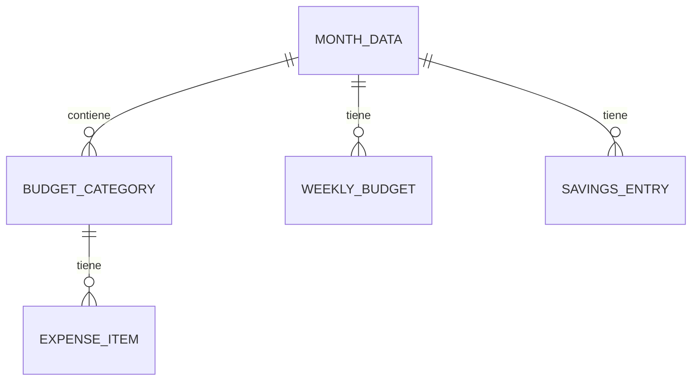

# PocketPlan - Esquema de Datos

Este documento describe el modelo de datos de PocketPlan, una aplicación de seguimiento de presupuesto personal.

## Diagrama Entidad-Relación



## Entidades

### MonthData

| Campo | Tipo | Descripción |
|-------|------|-------------|
| id | string | Identificador único (formato: YYYY-MM) |
| year | number | Año |
| month | number | Mes (1-12) |
| salary | number | Salario del mes (en COP) |
| categories | BudgetCategory[] | Lista de categorías de presupuesto |
| weeklyBudgets | WeeklyBudget[] | Presupuesto semanal |
| savings | SavingsEntry[] | Entradas de ahorro |

### BudgetCategory

| Campo | Tipo | Descripción |
|-------|------|-------------|
| id | string | Identificador único |
| name | string | Nombre de la categoría |
| percentage | number | Porcentaje del salario (%) |
| budget | number | Presupuesto asignado (calculado) |
| items | ExpenseItem[] | Lista de gastos |
| color | string | Color para visualización (chart-1 a chart-5) |

### ExpenseItem

| Campo | Tipo | Descripción |
|-------|------|-------------|
| id | string | Identificador único |
| name | string | Nombre del gasto |
| amount | number | Monto (en COP) |
| icon | string (opcional) | Icono de Lucide React |

### WeeklyBudget

| Campo | Tipo | Descripción |
|-------|------|-------------|
| label | string | Etiqueta (ej: "Semana 1") |
| amount | number | Presupuesto semanal |

### SavingsEntry

| Campo | Tipo | Descripción |
|-------|------|-------------|
| id | string | Identificador único |
| name | string | Nombre del ahorro |
| amount | number | Monto ahorrado |
| date | string | Fecha (formato: YYYY-MM-DD) |

## Categorías Por Defecto

| ID | Nombre | Porcentaje |
|----|--------|------------|
| vivienda | Vivienda | 25% |
| gastos-personales | Gastos Personales | 30% |
| ahorros-inv | Ahorros e Inversiones | 30% |
| diversion | Diversión | 10% |
| imprevistos | Imprevistos | 5% |

## Cálculos de Presupuesto

### Presupuesto de Categoría
```
budget = salary * percentage / 100
```

### Monto Restante
```
remaining = budget - sum(items.amount)
```

### Porcentaje Usado
```
usagePercentage = (totalSpent / budget) * 100
```

## Moneda

- **Código:** COP (Peso Colombiano)
- **Formato:** `Intl.NumberFormat("es-CO", { style: "currency", currency: "COP" })`
- **Ejemplo:** `$7.200.000`
